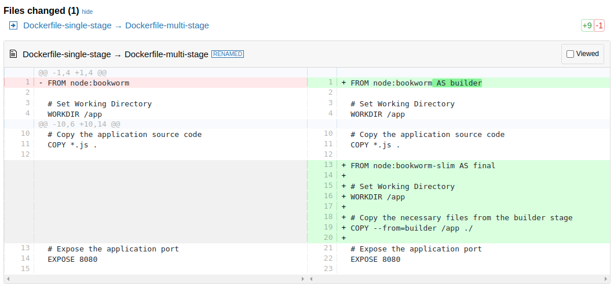
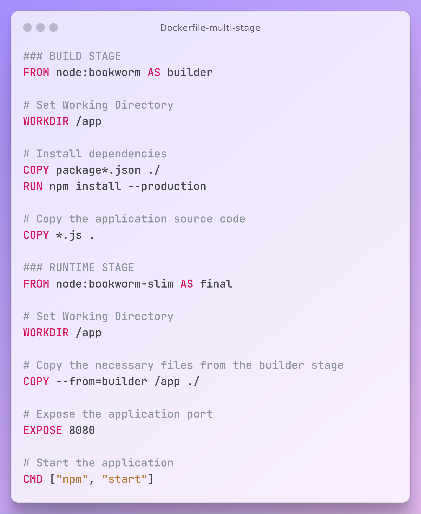

# Single-Stage vs Multi-Stage example





---

## Step 1: Introduction

1. Create a simple Node.js application.
2. Create a **single-stage** build and verify the Docker image size.
3. Create a **multi-stage** build and verify the Docker image size.

---

## Step 2: Single-Stage: Create Simple Node.js Application

- **Folders:** `01-nodejsapp-singlestage` & `02-nodejsapp-multistage`

### Step 2.1: `package.json`

- **Location:** Both folders (`01-nodejsapp-singlestage` & `02-nodejsapp-multistage`)

```json
{
  "name": "multistage-node-app",
  "version": "1.0.0",
  "description": "A sample Node.js app with multistage Docker build",
  "main": "index.js",
  "scripts": {
    "start": "node index.js"
  },
  "author": "KMS Healthcare",
  "license": "ISC",
  "dependencies": {
    "express": "^4.18.2"
  }
}
```

### Step 2.2: `index.js`

- **Location:** Both folders (`01-nodejsapp-singlestage` & `02-nodejsapp-multistage`)

```javascript
const express = require('express');
const app = express();
const port = process.env.PORT || 8080;

app.get('/', (req, res) => {
  res.send('Hello from Node.js app!');
});

app.listen(port, () => {
  console.log(`App listening at http://localhost:${port}`);
});
```

---

## Step 3: Single-Stage

### Step 3.1: Create Single-Stage Dockerfile

- **Folder:** `01-nodejsapp-singlestage`

```dockerfile
# Single-stage Dockerfile for Node.js app
FROM node:bookworm

# Set Working Directory
WORKDIR /app

# Install dependencies
COPY package*.json ./
RUN npm install --production

# Copy the application source code
COPY *.js .

# Expose the application port
EXPOSE 8080

# Start the application
CMD ["npm", "start"]
```

### Step 3.2: Build Docker Image

```bash
# Change Directory
cd $(git rev-parse --show-toplevel)/c40-Docker-BUILD-Multi-stage-Builds/01-nodejsapp-singlestage

# Build the Docker image
docker build -t nodejs-hello-singlestage .

# Run the Docker container
docker run --name nodejsapp-singlestage -d -p 8091:8080 nodejs-hello-singlestage
```

Access Application http://localhost:8091

---

## Step 4: Multi-Stage

### Step 4.1: Create Multi-Stage Dockerfile

- **Folder:** `02-nodejsapp-multistage`

```dockerfile
##### Stage 1: Builder Stage #####
FROM node:bookworm AS builder

# Set Working Directory
WORKDIR /app

# Install dependencies
COPY package*.json ./
RUN npm install --production

# Copy the application source code
COPY *.js .

##### Stage 2: Final Stage #####
FROM node:bookworm-slim AS final

# Set Working Directory
WORKDIR /app

# Copy the necessary files from the builder stage
COPY --from=builder /app ./

# Expose the application port
EXPOSE 8080

# Start the application
CMD ["npm", "start"]
```

### Step 4.2: Build Docker Image

```bash
# Change Directory
cd $(git rev-parse --show-toplevel)/c40-Docker-BUILD-Multi-stage-Builds/02-nodejsapp-multistage

# Build the Docker image
docker build -t nodejs-hello-multistage .

# Run the Docker container
docker run --name nodejsapp-multistage -d -p 8092:8080 nodejs-hello-multistage
```

Access Application http://localhost:8092

---

## Step 5: Review both Docker Image sizes

```bash
# List Docker images
docker images
```

```bash
REPOSITORY                         TAG               IMAGE ID       CREATED          SIZE
nodejs-hello-multistage            latest            71ca7fb7c2e1   47 seconds ago   227MB
nodejs-hello-singlestage           latest            10ea2986846a   5 minutes ago    1.13GB
```

**Observation:**

1. **Size Difference:**
   - `nodejs-hello-singlestage`: Approximately **1.13GB**
   - `nodejs-hello-multistage`: Approximately **227MB**

2. **Conclusion:**
   - Using multi-stage Dockerfiles significantly reduces the image size by eliminating unnecessary layers and files not needed in the final image.

---

## Step 6: Clean Up

```bash
# Stop and remove the container
docker rm -f nodejsapp-singlestage
docker rm -f nodejsapp-multistage

# Remove Docker images
docker rmi nodejs-hello-singlestage
docker rmi nodejs-hello-multistage
```

---
